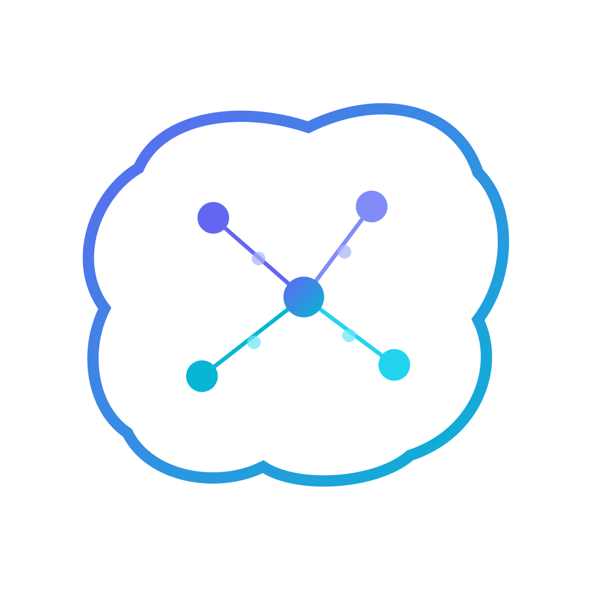

<p align="center">
  
</p>

<h1 align="center">Cortx</h1>

<p align="center">
  <strong>당신의 뇌는 5개의 컨텍스트를 동시에 들 수 없습니다. Cortx는 됩니다.</strong><br/>
  Claude Code를 태스크 중심 개발 워크플로로 바꿔주는 데스크톱 앱.
</p>

<p align="center">
  <a href="https://github.com/ilflow4592/cortx/releases/latest"><strong>다운로드</strong></a> &nbsp;·&nbsp;
  macOS (ARM/Intel) &nbsp;·&nbsp; Windows &nbsp;·&nbsp; Linux
</p>

---

## 작동 방식

Cortx는 `claude` CLI를 감싸고 각 태스크에 독립된 환경을 제공합니다. 브랜치 전환 없이, 세션 간 간섭 없이 여러 AI 개발 태스크를 병렬 관리합니다.

### 워크플로: 티켓에서 PR까지

```
1. 태스크 생성          2. 컨텍스트 첨부        3. 파이프라인 실행
   ┌──────────────┐         ┌──────────────┐         ┌──────────────┐
   │ + 새 태스크    │         │ Context Pack │         │ /pipeline:   │
   │ 브랜치: feat/ │   →     │ Notion 페이지 │   →     │  dev-task    │
   │ BE-1234       │         │ Slack 쓰레드  │         │              │
   │               │         │ GitHub 이슈   │         │ Grill-me Q&A │
   └──────────────┘         └──────────────┘         └──────────────┘
                                                            │
   6. 리뷰 루프           5. 커밋 & PR            4. 구현
   ┌──────────────┐         ┌──────────────┐         ┌──────────────┐
   │ CI 리뷰      │         │ /git:commit  │         │ /pipeline:   │
   │ 봇 코멘트    │   ←     │ /git:pr      │   ←     │  dev-implement│
   │ 자동 수정    │         │              │         │              │
   │ 재푸시       │         │ 사용자 확인   │         │ 코드 + 테스트 │
   └──────────────┘         └──────────────┘         └──────────────┘
```

### 단계별 사용법

**1단계: 프로젝트와 태스크 생성**

Cortx를 열고 git 리포지토리를 프로젝트로 등록, 태스크를 생성합니다. 각 태스크는 자동으로:

- 독립된 git worktree (`.worktrees/<branch-name>/`)
- 전용 Claude Code 세션
- 전용 터미널

**2단계: Context Pack 구성**

**Context Pack** 탭에서 태스크 명세를 첨부:

- **Notion** — Notion 페이지 URL 붙여넣기 또는 MCP 검색
- **Slack** — MCP를 통해 관련 쓰레드 메시지 가져오기
- **GitHub** — 이슈나 PR 토론 첨부
- **Pin** — 로컬 파일 드래그 & 드롭

Context Pack은 파이프라인 시작 시 Claude 프롬프트에 주입되어, 수동 복사 붙여넣기 없이 Claude가 태스크를 이해합니다.

**3단계: `/pipeline:dev-task` 실행 (Grill-me)**

Claude 탭에서 `/pipeline:dev-task`를 입력하거나 사이드바의 **Run Pipeline**을 클릭. Claude가:

1. Context Pack 읽기
2. 프로젝트 컨벤션 로드 (`.ai/docs/`, `ARCHITECTURE.md`)
3. 코드베이스에서 관련 파일 탐색
4. 하나씩 질문 (**Grill-me** — 비즈니스 결정만, 코드에서 파악 가능한 기술적 세부사항은 묻지 않음)

질문에 답변 후 "끝" 또는 "done" 입력.

**4단계: `/pipeline:dev-implement` 실행**

Claude가 개발 계획을 작성하고 구현:

1. 프로젝트 컨벤션에 따라 코드 작성
2. 테스트 실행
3. 커밋 전 사용자 확인 요청

**5단계: 커밋 & PR 생성**

`/git:commit`으로 Conventional Commit 메시지, `/git:pr`로 `.github/PULL_REQUEST_TEMPLATE.md` 기반 PR 생성.

두 명령 모두 실행 전 사용자 확인 필요.

**6단계: 리뷰 루프 (`/pipeline:dev-review-loop`)**

푸시 후 CI가 Claude 기반 PR 리뷰를 실행. 그 다음:

1. Cortx가 리뷰 코멘트 수집
2. 각각 분류: 수용 / 부분 수용 / 인지 / 거부
3. 코드 수정 + 코멘트 답변
4. 커밋 & 푸시 전 사용자 확인
5. CI 리뷰가 승인할 때까지 반복

파이프라인 대시보드에서 모든 단계의 진행 상황을 실시간 추적.

---

## 기능

| 기능                     | 설명                                                             |
| ------------------------ | ---------------------------------------------------------------- |
| **태스크 = Worktree**    | 각 태스크마다 독립된 `.worktrees/<slug>` 디렉토리                |
| **Claude Code 통합**     | 기존 Claude CLI 구독 사용 (OAuth 또는 API 키)                    |
| **파이프라인 워크플로**  | Grill-me → 개발 계획 → 구현 → 커밋/PR → 리뷰, 실시간 대시보드    |
| **멀티태스크 병렬 실행** | 여러 태스크에서 동시에 파이프라인 실행                           |
| **Context Pack**         | GitHub, Slack, Notion에서 MCP로 자동 수집; 파일 드래그 & 드롭    |
| **내장 터미널**          | xterm.js + Rust PTY, worktree에서 시작, 태스크별 1개             |
| **세션 유지**            | Claude `--resume` 세션 ID가 앱 재시작 후에도 유지                |
| **멀티 윈도우**          | 태스크를 별도 창으로 분리                                        |
| **커맨드 팔레트**        | 빠른 탐색 및 명령 실행 (⌘K)                                      |
| **비용 대시보드**        | 태스크별 API 토큰 사용량 및 비용 추적                            |
| **Diff 뷰어**            | 인라인 변경 하이라이팅이 포함된 시각적 git diff                  |
| **변경사항 뷰**          | 커밋 전 파일 스테이지/언스테이지, diff 리뷰                      |
| **MCP 서버 관리자**      | 프로젝트별 MCP 서버 검색, 추가, 토글, 설정                       |
| **프로젝트 스캔**        | 프로젝트 생성 시 기술 스택, 문서 품질, 언어 히스토그램 자동 감지 |
| **슬래시 커맨드 빌더**   | 파이프라인 슬래시 커맨드 시각적 에디터                           |
| **자동 업데이트**        | 서명된 릴리즈를 통한 인앱 업데이트 확인                          |
| **크래시 복구**          | 예기치 않은 크래시 후 자동 세션 복구 다이얼로그                  |
| **Worktree 정리**        | 오래된 worktree와 브랜치 일괄 정리                               |
| **일일 리포트**          | 집중 시간, 인터럽트 통계, 집중 비율                              |
| **다국어 지원**          | 한국어 / 영어                                                    |

## 빠른 시작

```bash
git clone https://github.com/ilflow4592/cortx.git
cd cortx
./setup.sh
```

### `setup.sh` 자동 설치 항목

- Homebrew, Node.js 22, Rust (rustup 통해)
- Ollama + `nomic-embed-text` 임베딩 모델
- Qdrant 컨테이너 (Docker가 이미 설치된 경우)
- npm 의존성
- Cortx `.dmg` 빌드 (선택)

### 수동 사전 요구사항

**Claude CLI** (필수):

```bash
npm install -g @anthropic-ai/claude-code
claude login
```

**Docker Desktop** (선택 — Qdrant 시맨틱 검색용):

```bash
brew install --cask docker
open -a Docker
```

설치 후 `./setup.sh`를 다시 실행하면 나머지 설정이 완료됩니다.

## 아키텍처

```
프론트엔드 (React + TypeScript)               백엔드 (Rust + Tauri 2)
├── components/                               ├── lib.rs           — 앱 빌더 + 정상 종료
│   ├── claude/        — 채팅 UI + 세션       ├── pty.rs           — PTY 관리 (터미널 + Claude CLI)
│   │   ├── ChatInput, ChatMessageList        ├── types.rs         — 공용 구조체
│   │   ├── claudeEventProcessor.ts           └── commands/
│   │   └── pipelineMarkers.ts                    ├── claude/      — CLI spawn + 스트리밍
│   ├── context/       — Context Pack UI          │   ├── spawn.rs     — 프로세스 생명주기
│   │   ├── ContextPack, ContextItemCard          │   ├── pty_proxy.rs — PTY 브릿지
│   │   ├── SearchResourcesGrid                   │   ├── slash.rs     — 슬래시 커맨드 해석
│   │   └── useFileDropHandler.ts                 │   └── window.rs    — 멀티 윈도우
│   ├── sidebar/       — 태스크 목록 + 파이프라인  ├── scan/        — 프로젝트 스캐닝
│   │   ├── TaskRow, ProjectGroup                 │   ├── tech_stack.rs — 매니페스트 감지
│   │   └── usePipelineRunner.ts                  │   ├── grader.rs    — 문서 품질 등급
│   ├── cost-dashboard/ — API 비용 추적           │   ├── scaffold.rs  — 자동 채움 템플릿
│   ├── diff-viewer/    — git diff 표시           │   └── fallback.rs  — 파일 트리 폴백
│   ├── changes-view/   — 스테이징 UI             ├── mcp/         — MCP 서버 관리
│   ├── mcp-manager/    — MCP 설정 UI             │   ├── discovery.rs · mutate.rs
│   ├── command-palette/ — ⌘K 탐색               │   ├── toggle.rs   · json_io.rs
│   ├── slash-builder/  — 커맨드 에디터           ├── git.rs       — worktree + diff
│   ├── settings/       — 앱 설정                 ├── oauth.rs     — Claude OAuth 콜백
│   ├── right-panel/    — 대시보드 + 탭           ├── shell.rs     — 셸 실행 + cortx.yaml
│   └── main-panel/     — 태스크 헤더 + 탭        ├── secrets.rs   — 자격 증명 관리
│                                                 └── notion_api.rs — Notion API 프록시
├── stores/ (Zustand 9개)
│   ├── taskStore       — 태스크 + worktree
│   ├── projectStore    — 프로젝트 + 스캔 상태
│   ├── contextPackStore — 컨텍스트 아이템
│   ├── settingsStore   — 사용자 설정
│   ├── mcpStore        — MCP 서버 상태
│   ├── modalStore      — 중앙화된 모달 상태
│   ├── layoutStore     — 패널 크기 + 가시성
│   ├── scanStatusStore — 프로젝트 스캔 진행
│   └── contextHistoryStore — 검색 기록
│
├── services/
│   ├── contextCollection.ts  — 통합 컨텍스트 수집
│   ├── contextSources/       — GitHub, Slack, Notion 수집기
│   ├── db/                   — SQLite (better-sqlite3)
│   ├── vector-search/        — Ollama + Qdrant 시맨틱 검색
│   ├── persistence.ts        — localStorage 디바운스 저장
│   ├── updater.ts            — 자동 업데이트 서비스
│   ├── secrets.ts            — 자격 증명 관리
│   └── task-export/          — JSON/Markdown 내보내기
│
├── hooks/
│   ├── useInitialLoad.ts     — 앱 시작 시퀀스
│   ├── useStorePersistence.ts — 변경 시 저장
│   ├── useGlobalShortcuts.ts  — 키보드 단축키
│   ├── usePipelineConfig.ts   — 파이프라인 설정
│   └── useProjectScan.ts     — 스캔 오케스트레이션
│
└── types/
    └── generated/ (13개 타입)  ← ts-rs 자동 생성
```

**핵심 설계 결정:**

- `/pipeline:dev-task` 채팅 입력과 "Run Pipeline" 버튼 모두 동일한 `runPipeline()` 유틸리티 호출
- 메시지 캐시는 모듈 레벨 → 태스크 전환 시 스트리밍 상태 유지
- 슬래시 커맨드는 `.claude/commands/**.md`에서 해석 (프로젝트 우선, 이후 글로벌)
- 파이프라인 단계는 Claude가 텍스트에 출력하는 `[PIPELINE:phase:status]` 마커로 추적
- 모달 상태는 `useModalStore`로 중앙화 — props drilling 없음
- 큰 컴포넌트(>300줄)는 `api.ts`, `types.ts`, `parse.ts` 패턴의 서브디렉토리로 분해
- 모든 Tauri API import는 동적 `import()` 사용 — webview 초기화 이슈 방지

## 파이프라인 스킬

| 명령                        | 용도                              |
| --------------------------- | --------------------------------- |
| `/pipeline:dev-task`        | Grill-me Q&A + 개발 계획서 작성   |
| `/pipeline:dev-implement`   | 계획 → 구현 → 테스트 → 커밋/PR    |
| `/pipeline:dev-review-loop` | CI 리뷰 대응 → 수정 → 재푸시 루프 |
| `/pipeline:dev-resume`      | 중단된 파이프라인 재개            |
| `/pipeline:pr-review-fu`    | 리뷰 지적 해결 추적 + 증분 리뷰   |
| `/git:commit`               | Conventional Commit + 자동 푸시   |
| `/git:pr`                   | 템플릿 기반 PR 생성               |

스킬은 `.claude/commands/pipeline/*.md`에 위치하며 실행 시 `$ARGUMENTS`, `{TASK_ID}`, `{TASK_NAME}`이 치환됩니다.

## 개발

```bash
npm run tauri dev      # 개발 모드
npm run tauri build    # 프로덕션 빌드 (.dmg / .msi / .deb)
npm run lint           # ESLint
npm run format         # Prettier
npm run test           # Vitest (28개 테스트 파일)
cd src-tauri && cargo test --lib  # Rust 테스트 (39개) + ts-rs 타입 내보내기
```

## 기술 스택

| 레이어      | 기술                                 |
| ----------- | ------------------------------------ |
| 프레임워크  | Tauri 2                              |
| 프론트엔드  | React 18 + TypeScript 6 + Vite 8     |
| 스타일      | Tailwind CSS v4                      |
| 상태 관리   | Zustand 5                            |
| 저장소      | localStorage (디바운스 저장)         |
| 터미널      | xterm.js 6 + Rust `portable-pty`     |
| Claude      | Claude CLI via PTY (stream-json)     |
| 타입 동기화 | ts-rs (Rust → TypeScript, 13개 타입) |
| 임베딩      | Ollama (`nomic-embed-text`)          |
| 벡터 DB     | Qdrant                               |
| 테스트      | Vitest + Cargo test                  |

## 선택적 서비스

| 서비스     | 용도                                  | 필수?  |
| ---------- | ------------------------------------- | ------ |
| Claude CLI | Claude Code 통합                      | 예     |
| Ollama     | 시맨틱 검색용 로컬 임베딩             | 아니오 |
| Qdrant     | 태스크 간 지식 공유용 벡터 DB         | 아니오 |
| MCP 서버   | 컨텍스트 수집 (GitHub, Notion, Slack) | 아니오 |
| Docker     | Qdrant 실행에 필요                    | 아니오 |

## 라이선스

MIT
